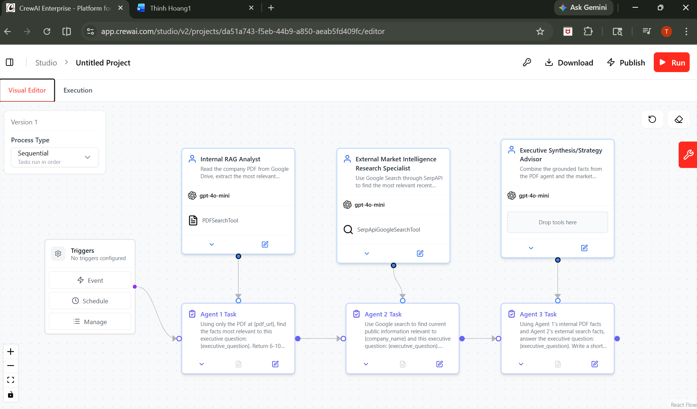

# AI Market Intelligence Workflow (CrewAI)
## Workflow Diagram

## Overview
This project builds a multi-agent AI system that analyzes company PDF reports and combines them with external market intelligence to generate executive-level insights.

## How It Works
1. **Internal RAG Analyst**
   - Extracts key facts from company PDF reports using PDFSearchTool
2. **External Research Agent**
   - Uses Google Search (SerpAPI) to gather real-time market data
3. **Strategy Advisor**
   - Combines both sources to generate business insights (strengths, risks, opportunities)

## Features
- Multi-agent orchestration using CrewAI
- Retrieval-Augmented Generation (RAG) from PDFs
- Real-time external data integration
- Executive-style structured outputs

## Example Questions
- What are the biggest risks facing this company?
- What growth opportunities exist based on market trends?
- How does this company compare to competitors?

## Tech Stack
- Python
- CrewAI
- PDFSearchTool (RAG)
- SerpAPI (Google Search)

## Results
- Automated business intelligence pipeline
- Combines internal + external data (real-world use case)
- Produces structured insights for decision-making

## Author
Thinh Hoang
